# 작성일
```
26.08.26
```

## 목차
- [Introduction](#introduction)
  - [Scope](#scope)
  - [mipi_D-PHY_specification_v1-2 스펙 제외 영역](#mipi_d-phy_specification_v1-2-스펙-제외-영역)
- [Terminology](#terminology)
  - [Definitions](#definitions)
  - [Acronyms](#acronyms)
- [D-PHY Overview](#d-phy-overview)
  - [Summary of PHY Functionality](#summary-of-phy-functionality)
- [Architecture](#architecture)
  - [Lane Modules](#lane-modules)
  - [Master and Slave](#master-and-slave)
  - [High Frequency Clock Generation](#high-frequency-clock-generation)
  - [Clock Lane, Data Lanes and the PHY-Protocol Interface](#clock-lane-data-lanes-and-the-phy-protocol-interface)
  - [Selectable Lane Options](#selectable-lane-options)
  - [Lane Module Types](#lane-module-types)
    - [Unidirectional Data Lane](#unidirectional-data-lane)
    - [Bi-directional Data Lanes](#bi-directional-data-lanes)
    - [Clock Lane](#clock-lane)
  - [Configurations](#configurations)
    - [Unidirectional Configurations](#unidirectional-configurations)
    - [Bi-Directional Half-Duplex Configurations](#bi-directional-half-duplex-configurations)
    - [Mixed Data Lane Configurations](#mixed-data-lane-configurations)
- [Global Operation](#global-operation)
  - [Transmission Data Structure](#transmission-data-structure)
    - [Data Units](#data-units)
    - [Bit order, Serialization, and De-Serialization](#bit-order-serialization-and-de-serialization)
    - [Encoding and Decoding](#encoding-and-decoding)
    - [Data Buffering](#data-buffering)
  - [Lane States and Line Levels](#lane-states-and-line-levels)
  - [Operating Modes: Control, High-Speed, and Escape](#operating-modes-control-high-speed-and-escape)
  - [High-Speed Data Transmission](#high-speed-data-transmission)
    - [Burst Payload Data](#burst-payload-data)
    - [Start-of-Transmission](#start-of-transmission)
    - [End-of-Transmission](#end-of-transmission)
    - [HS Data Transmission Burst](#hs-data-transmission-burst)
  - [Bi-directional Data Lane Turnaround](#bi-directional-data-lane-turnaround)
  - [Escape Mode](#escape-mode)
    - [Remote Triggers](#remote-triggers)
    - [Low-Power Data Transmission](#low-power-data-transmission)
    - [Ultra-Low Power State](#ultra-low-power-state)
    - [Escape Mode State Machine](#escape-mode-state-machine)
  - [High-Speed Clock Transmission](#high-speed-clock-transmission)
  - [Clock Lane Ultra-Low Power State](#clock-lane-ultra-low-power-state)
  - [Global Operation Timing Parameters](#global-operation-timing-parameters)
  - [System Power States](#system-power-states)
  - [Initialization](#initialization)
  - [Calibration](#calibration)
  - [Global Operation Flow Diagram](#global-operation-flow-diagram)
  - [Data Rate Dependent Parameters (informative)](#data-rate-dependent-parameters-informative)
    - [Parameters Containing Only UI Values](#parameters-containing-only-ui-values)
    - [Parameters Containing Time and UI values](#parameters-containing-time-and-ui-values)
    - [Parameters Containing Only Time Values](#parameters-containing-only-time-values)
    - [Parameters Containing Only Time Values That Are Not Data Rate Dependent](#parameters-containing-only-time-values-that-are-not-data-rate-dependent)
- [Fault Detection](#fault-detection)
  - [Contention Detection](#contention-detection)
  - [Sequence Error Detection](#sequence-error-detection)
  - [Protocol Watchdog Timers (informative)](#protocol-watchdog-timers-informative)
- [Interconnect and Lane Configuration](#interconnect-and-lane-configuration)
  - [Lane Configuration](#lane-configuration)
  - [Boundary Conditions](#boundary-conditions)
  - [Definitions](#definitions-1)
  - [S-parameter Specifications](#s-parameter-specifications)
  - [Characterization Conditions](#characterization-conditions)
  - [Interconnect Specifications](#interconnect-specifications)
    - [Differential Characteristics](#differential-characteristics)
    - [Common-mode Characteristics](#common-mode-characteristics)
    - [Intra-Lane Cross-Coupling](#intra-lane-cross-coupling)
    - [Mode-Conversion Limits](#mode-conversion-limits)
    - [Inter-Lane Cross-Coupling](#inter-lane-cross-coupling)
    - [Inter-Lane Static Skew](#inter-lane-static-skew)
  - [Driver and Receiver Characteristics](#driver-and-receiver-characteristics)
    - [Differential Characteristics](#differential-characteristics-1)
    - [Common-Mode Characteristics](#common-mode-characteristics-1)
    - [Mode-Conversion Limits](#mode-conversion-limits-1)
    - [Inter-Lane Matching](#inter-lane-matching)
- [Electrical Characteristics](#electrical-characteristics)
  - [Driver Characteristics](#driver-characteristics)
    - [High-Speed Transmitter](#high-speed-transmitter)
    - [Low-Power Transmitter](#low-power-transmitter)
  - [Receiver Characteristics](#receiver-characteristics)
    - [High-Speed Receiver](#high-speed-receiver)
    - [Low-Power Receiver](#low-power-receiver)
  - [Line Contention Detection](#line-contention-detection)
  - [Input Characteristics](#input-characteristics)
- [High-Speed Data-Clock Timing](#high-speed-data-clock-timing)
  - [High-Speed Clock Timing](#high-speed-clock-timing)
  - [Forward High-Speed Data Transmission Timing](#forward-high-speed-data-transmission-timing)
    - [Data-Clock Timing Specifications](#data-clock-timing-specifications)
  - [Reverse High-Speed Data Transmission Timing](#reverse-high-speed-data-transmission-timing)
- [Regulatory Requirements](#regulatory-requirements)
- [Annex A Logical PHY-Protocol Interface Description (informative)](#annex-a-logical-phy-protocol-interface-description-informative)
  - [Signal Description](#signal-description)
  - [High-Speed Transmit from the Master Side](#high-speed-transmit-from-the-master-side)
  - [High-Speed Receive at the Slave Side](#high-speed-receive-at-the-slave-side)
  - [High-Speed Transmit from the Slave Side](#high-speed-transmit-from-the-slave-side)
  - [High-Speed Receive at the Master Side](#high-speed-receive-at-the-master-side)
  - [Low-Power Data Transmission](#low-power-data-transmission-1)
  - [Low-Power Data Reception](#low-power-data-reception)
  - [Turn-around](#turn-around)
  - [Calibration](#calibration-1)
- [Annex B Interconnect Design Guidelines (informative)](#annex-b-interconnect-design-guidelines-informative)
  - [Practical Distances](#practical-distances)
  - [RF Frequency Bands: Interference](#rf-frequency-bands-interference)
  - [Transmission Line Design](#transmission-line-design)
  - [Reference Layer](#reference-layer)
  - [Printed-Circuit Board](#printed-circuit-board)
  - [Flex-foils](#flex-foils)
  - [Series Resistance](#series-resistance)
  - [Connectors](#connectors)
- [Annex C 8b9b Line Coding for D-PHY (normative)](#annex-c-8b9b-line-coding-for-d-phy-normative)
  - [Line Coding Features](#line-coding-features)
    - [Enabled Features for the Protocol](#enabled-features-for-the-protocol)
    - [Enabled Features for the PHY](#enabled-features-for-the-phy)
  - [Coding Scheme](#coding-scheme)
    - [8b9b Coding Properties](#8b9b-coding-properties)
    - [Data Codes: Basic Code Set](#data-codes-basic-code-set)
    - [Comma Codes: Unique Exception Codes](#comma-codes-unique-exception-codes)
    - [Control Codes: Regular Exception Codes](#control-codes-regular-exception-codes)
    - [Complete Coding Scheme](#complete-coding-scheme)
  - [Operation with the D-PHY](#operation-with-the-d-phy)
    - [Payload: Data and Control](#payload-data-and-control)
    - [Details for HS Transmission](#details-for-hs-transmission)
    - [Details for LP Transmission](#details-for-lp-transmission)
  - [Error Signaling](#error-signaling)
  - [Extended PPI](#extended-ppi)
  - [Complete Code Set](#complete-code-set)

---

# Introduction
> 목표: a flexible, low-cost, High-Speed serial interface solution

## Scope
> MIPI Alliance의 애플리케이션 또는 프로토콜 레벨 사양에서 적용될 고속(High-Speed) 소스 동기(source-synchronous) 인터페이스의 최하위 계층들.

```
이 내용은 물리적 인터페이스, 전기적 인터페이스, 로우레벨 타이밍, 그리고 PHY 레벨 프로토콜을 포함합니다. 이러한 기능 영역들을 통틀어 D-PHY라고 합니다.
```

## mipi_D-PHY_specification_v1-2 스펙 제외 영역
* 클록 생성 유닛 신호의 명시적 스펙
* 테스트 모드, 패턴, 및 구성
* 충돌 상황을 해결하기 위한 절차
* 서로 다른 Lane Module 타입 간 연결의 정상 동작 보장
* 어느 정도의 IO 정전기 이벤트를 손상 없이 견딜 수 있는가
* 정확한 비트 오류율(Bit-Error-Rate, BER) 값 but BER < 10^-12
* 완벽한 PHY-Protocol Interface의 스펙 but 예시 수록
* 구현

# Terminology
## Definitions
PPI: PHY-Protocol Interface
APPI: Abstracted PPI -> 여러 종류의 PHY에 공통적으로 적용될 수 있도록 추상화된 형태의 인터페이스
PHY Adapter: APPI의 심볼을 특정 PPI 신호로 바꾸는 레이어
Master: HS 클럭을 보내는 곳
Slave: HS 클럭을 받는 곳, but 역방향으로 data 전송 가능
Turnaround: 데이터 레인의 전송 방향을 바꾸는거
Half-duplex operation: 양방향이 가능하지만 동시에는 불가능하고 한 방향으로만 할 수 있는거
Termination: 전송선(라인) 끝에 특정 저항값의 저항을 달아서, 신호가 그 끝에서 반사되지 않고 흡수되도록 만드는 것.
```
고속 신호가 배선을 타고 이동하다가 끝에 도달했을 때, 만약 배선의 임피던스와 그 끝에 연결된 회로의 임피던스가 다르면(임피던스 불일치), 신호 에너지 일부가 **반사(reflection)**되어 다시 반대 방향으로 되돌아갑니다. 이를 방지하기 위해 RX 입력단에 배선의 특성 임피던스와 정확히 같은 값의 저항을 달아서 반사 없이 깨끗하게 종료되게 만듦.
```

## Acronyms
| 약어 | 전체 명칭 |
|---|---|
| CIL | Control and Interface Logic |
| DDR | Double Data Rate |
| EMI | Electro Magnetic Interference |
| EoT | End of Transmission |
| HS | High-Speed; identifier for operation mode |
| HS-RX | High-Speed Receiver (Low-Swing Differential) |
| HS-TX | High-Speed Transmitter (Low-Swing Differential) |
| ISTO | Industry Standards and Technology Organization |
| LP | Low-Power; identifier for operation mode |
| LP-CD | Low-Power Contention Detector |
| LPDT | Low-Power Data Transmission |
| LP-RX | Low-Power Receiver (Large-Swing Single-Ended) |
| LP-TX | Low-Power Transmitter (Large-Swing Single-Ended) |
| LPS | Low-Power State(s) |
| LSB | Least Significant Bit |
| Mbps | Megabits per second |
| MSB | Most Significant Bit |
| PLL | Phase-Locked Loop |
| RF | Radio Frequency |
| SE | Single-Ended |
| SoT | Start of Transmission |
| TLIS | Transmission-Line Interconnect Structure: physical interconnect realization between Master and Slave |
| UI | Unit Interval, equal to the duration of any HS state on the Clock Lane |
| ULPS | Ultra-Low Power State |

# D-PHY Overview
## Summary of PHY Functionality
* 기본 구조
    * D-PHY는 Master ↔ Slave 간 동기(synchronous) 연결 제공
    * 클록 신호는 단방향 (Master → Slave 고정)
    * 데이터 신호는 옵션에 따라 단방향 또는 양방향 가능
    * 반이중(half-duplex) 동작 시, 역방향 대역폭은 순방향의 1/4

* 신호 모드
    * High-Speed 모드: 고속 데이터 트래픽용
    * Low-Power 모드: 제어(control) 목적
    * Low-Power Escape 모드 (옵션): 저속 비동기 데이터 통신용
    * 고속 데이터는 임의 개수의 payload byte로 구성된 버스트(burst) 형태로 전송

* 와이어 구성
    * Data Lane당 2선 + Clock Lane 2선 → 최소 구성 4선
    * High-Speed 모드: 양단 종단(terminated), low-swing 차동 신호
    * Low-Power 모드: 모든 선이 싱글엔디드(single-ended), 비종단(non-terminated)
    * EMI 대응을 위해 Low-Power 드라이버는 slew-rate 제어 및 전류 제한 필요

* 속도 범위
    * 최대 비트레이트는 송신기/수신기/interconnect 구현 성능에 따라 달라지며, 스펙에서 특정 값으로 명시하지 않음
    * 주 대상 범위: 80~1500 Mbps/Lane (deskew calibration 없이), 최대 2500 Mbps (deskew calibration 적용 시)
    * 1500 Mbps 초과 시 deskew 기능 필수 지원
    * Lane 수를 늘려 전체 데이터 용량 확장 가능
    * 버스트 모드 통신은 실효 처리량(effective throughput)을 낮출 수 있음
    * Low-Power 모드 최대 데이터 레이트: 10 Mbps

# Architecture
## Lane Modules
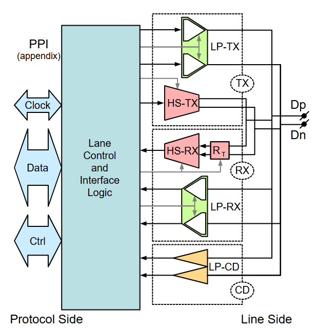

| 모듈 | 특징 | 설명 | 특징 |
|---|---|---|---|
| LP | Large swing (1.2V) | single-ended Low-Power function | 느린 edge rate |
| HS | Low Voltage swing (0.2V) | differential High-Speed function | 빠른 edge rate -> 종단저항 켜놓음. |
| LP-CD | 불량 감지 | Contention Detection | |

## High Frequency Clock Generation
클럭을 생성하는 Master 측에 PLL Clock Multiplier이 필요함.
-> 클럭은 PHY 외부에서 생성됨. => 사실 구현하는 사람 마음임..

## Clock Lane, Data Lanes and the PHY-Protocol Interface
| Two Data Lane & Clock Lane PHY 자료 |
|---|
|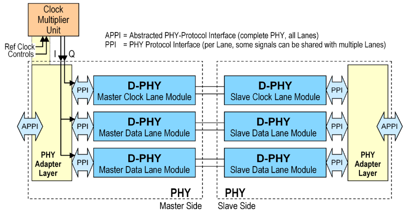|

```txt
- Master 측
Clock Multiplier Unit(PLL)이 외부에 있는 모습.
PHY Adapter Layer에서 다양한 PHY의 심볼을 디코딩한 다음, PPI를 거쳐서 레인 모듈에 전달.
- Slave 측
Master 반대
```

## Selectable Lane Options
필수 기능

모든 Data Lane은 정방향(Forward)에서 HS 모드와 Escape 모드 지원 필수
모든 Lane은 정방향에서 ULPS(Ultra-Low Power State)와 Trigger에 대한 Escape 지원 필수

선택 기능

Data Lane은 양방향 ↔ 단방향 선택 가능
양방향인 경우: HS 역방향 데이터 전송 / LP 역방향 Escape 모드 선택 가능
그 외 Escape 모드 기능들은 선택 사항 (→ Section 6.6 참조)

설계 시 고려사항

Application(응용 계층)이 필요한 Escape 모드 기능을 정의해야 함
양방향 Lane은 각 방향(정방향/역방향)마다 개별적으로 Escape 기능을 선택해야 함

결과: PHY Configuration의 자유도

단일 또는 다중 Data Lane
(Lane별) 양방향/단방향 여부
(Lane별) 지원되는 역방향 통신 종류
(Lane별, 방향별) 지원되는 Escape 모드 기능
데이터 전송 방식: 8비트 raw data(기본) 또는 8b9b 인코딩(Annex C)

| Configuration 절차 예시 |
|---|
|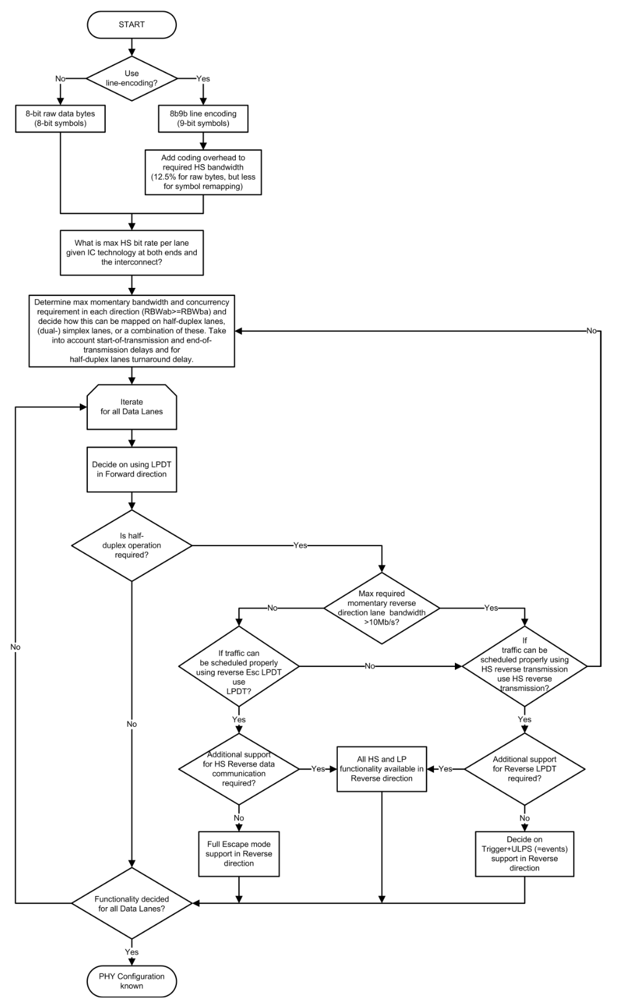|

## Lane Module Types
| Universal Lane Module Architecture |
|---|
|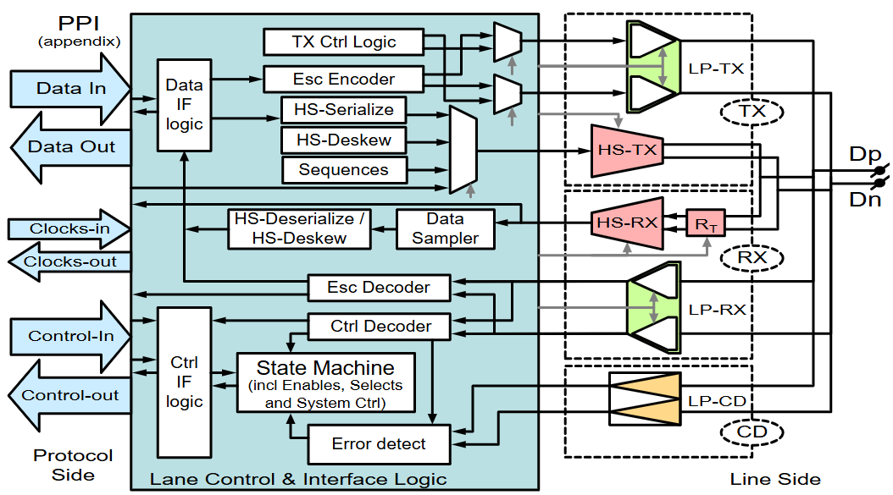|
| 모든 레인에 적용가능한 구조 -> 실제 구현에서는 필요없는 부분 제외 |

| Prefix | Lane Interconnect Side | High-Speed Capabilities | Forward Direction Escape Mode Features Supported | Reverse Direction Escape Mode Features Supported¹ |
|---|---|---|---|---|
| CIL- | M – Master<br>S – Slave<br>X – Don't Care | F – Forward Only<br>R – Reverse and Forward<br>X – Don't Care² | A – All (including LPDT)<br>E – events – Triggers and ULPS Only<br>X – Don't Care | A – All (including LPDT)<br>E – events – Triggers and ULPS Only<br>N – None<br>Y – Any (A, E, or A and E)<br>X – Don't Care |
| | | C – Clock | N – Not Applicable | N – Not Applicable |
> 기능을 축소시킨 구조에 대한 축약 네이밍 방법 설명표

### Unidirectional Data Lane
| 대상 | 최소 구성 | 축약 네이밍 |
|---|---|---|
| Master | HS-TX, LP-TX | CIL-MFXN |
| Slave  | HS-RX, LP-RX | CIL-SFXN |

### Bi-directional Data Lanes
> Master
| 종류 | 최소 구성 | 축약 네이밍 |
|---|---|---|---|
| HS Reverse 통신 없는거 | HS-TX, LP-TX, LP-RX, LP-CD | CIL-MFXY |
| HS Reverse 통신 있는거 | HS-TX, HS-RX, LP-TX, LP-RX, LP-CD | CIL-MRXX |

> Slave
| 종류 | 최소 구성 | 축약 네이밍 |
|---|---|---|---|
| HS Reverse 통신 없는거 | HS-RX, LP-RX, LP-TX, LP-CD | CIL-SFXY |
| HS Reverse 통신 있는거 | HS-RX, HS-TX, LP-RX, LP-TX, LP-CD | CIL-SRXX |

### Clock Lane
* 기본 구성
    * Clock Lane은 제한된 line state만 사용
    * 단, Clock 전송 및 Low-Power 모드에서는 단방향 데이터 레인과 동일한 TX/RX 기능 필요
    * Master 측: HS-TX + LP-TX + CIL-MCNN
    * Slave 측: HS-RX + LP-RX + CIL-SCNN

    (CIL-MCNN을 Table 1 규칙으로 해석하면: Master, Clock Lane, 정방향 Escape 없음, 역방향 Escape 해당없음)

* 단방향 데이터 레인과의 차이점
    * HS DDR 클록은 데이터와 동상이 아니라 90도 위상차로 전송됨
        -> edge랑 edge 중간에 데이터가 오게 함. 안정적인 데이터 샘플링을 위해.
    * Clock Lane의 Escape mode entry 방식이 Data Lane과 다름
    * Clock Lane은 ULPS만 지원하므로 별도의 Escape mode entry 코드가 불필요함

* 클록 생성 관련
    * 위상이 맞춰진 내부 클록 신호는 PHY 외부에서 생성되어 각 Lane에 전달됨
    * 클록 생성 유닛의 실제 구현은 이 스펙의 범위 밖

# Global Operation
## Transmission Data Structure
HS, LP 전송 중에 Link는 프로토콜 레이어에서 제공된 페이로드 데이터를 다른 쪽 Link로 보낸다. 이 섹션은 페이로드 데이터에 대한 제한사항을 명시한다.

### Data Units
최소 페이로드 데이터는 1 byte이고 정수개의 bytes로 이루어져야 한다.

### Bit order, Serialization, and De-Serialization
PHY는 들어오고 나가는 데이터가 어떤 의미인지 모르고, 데이터는 직렬/병렬로 나가거나 들어온다.

### Encoding and Decoding
압축 -> 다루지 않을 예정 (Annex C)

### Data Buffering
* 데이터 전송의 시작/유지는 프로토콜 계층이 주도함 (PHY가 아니라)
* 송신 측: 전송 요청이 유지되는 동안은 반드시 유효한 데이터를 계속 공급해야 함 → 중간에 멈추면 안 됨
* 수신 측: PHY가 데이터를 넘겨주는 즉시 즉각 받아야 함
* 데이터 스로틀링(속도 조절/일시 정지) 불가 → PHY는 "잠깐 기다려" 같은 흐름 제어를 지원하지 않음
* 만약 속도를 조절해야 한다면, 그건 PHY의 역할이 아니라 프로토콜 계층에서 버퍼링으로 처리해야 함

## Lane States and Line Levels
| Line_Levels |
|---|
|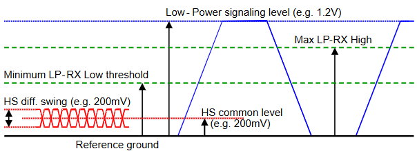|

> Table 2 Lane State Descriptions

| State Code | Line Voltage Levels (Dp-Line) | Line Voltage Levels (Dn-Line) | High-Speed (Burst Mode) | Low-Power (Control Mode) | Low-Power (Escape Mode) |
|---|---|---|---|---|---|
| HS-0 | HS Low | HS High | Differential-0 | N/A, Note 1 | N/A, Note 1 |
| HS-1 | HS High | HS Low | Differential-1 | N/A, Note 1 | N/A, Note 1 |
| LP-00 | LP Low | LP Low | N/A | IDLE | Space |
| LP-01 | LP Low | LP High | N/A | HS-Rqst | Mark-0 |
| LP-10 | LP High | LP Low | N/A | LP-Rqst | Mark-1 |
| LP-11 | LP High | LP High | N/A | Stop | N/A, Note 2 |

**Note:**
1. HS 전송 중에 LP RX는 LP-00을 보고 있음. 
    LP-00인 이유: 문턱 LP-RX가 0과 1을 비교하는 문턱 전압보다 HS의 전압크기가 더 작음.
2. Escape 모드 중에 LP-11이 일어나면 레인은 Control 모드 STOP 상태로 돌아간다.
3. LP 모드 Control 모드와 Escape 모드 구분 방법: Escape는 시퀀스가 존재하고 Control은 그냥 11, 10, 01, 00

## Operating Modes: Control, High-Speed, and Escape
일반적인 상황: 데이터 레인 -> LP(Control), HS 모드
데이터 버스트는 HS 모드에서만 동작.
Escape 모드: Control 모드에서 request를 통해(시퀀스 수행) 진입. 항상 LP-11로 탈출.

| request | LP sequence |
|---|---|
| HS entry mode | LP-11 -> LP-01 -> LP-00 |
| Escape mode | LP-11 -> LP-10 -> LP-00 -> LP-01 -> LP-00 |
| Turnaround | LP-11 -> LP-10 -> LP-00 -> LP-10 -> LP-00 |

## High-Speed Data Transmission
* 버스트 구조: HS 데이터 전송 = 각 전송마다 하나의 "burst" 단위
* 리더/트레일러 시퀀스: 수신 측 동기화를 위해 실제 데이터 앞뒤에 붙는 여분의 신호
    * 송신 측: 붙여서 보냄
    * 수신 측: 받아서 제거함 (상위 프로토콜엔 노출 안 됨)
    * 그래서 이건 전송 라인(물리적 와이어)에서만 관찰 가능 → 프로토콜 계층 입장에선 "안 보이는" 신호
* 버스트 사이 유휴 시간: Data Lane은 기본적으로 Stop 상태 유지 (Turnaround나 Escape 요청이 있을 때만 예외)
* Clock Lane 동작: HS Data Burst가 진행되는 동안 Clock Lane도 HS 모드로 전환되어, Slave 측에 DDR 클록을 계속 공급함

### Burst Payload Data
버스트의 페이로드 데이터가 짧은 경우는 start, end 준비 시간이 오히려 더 길 수 있음. -> 효율 bad
PHY 내부에서 HS 데이터 버스트 도중 자동 복구 수단은 없으므로 BER이 0이 될 수 없음. => 최대 버스트 길이로 어떤 값을 선택하는게 최선인지 고려해야함.

### Start-of-Transmission
| TX Side | RX Side |
|---|---|
| Drives Stop state (LP-11) | Observes Stop state |
| Drives HS-Rqst state (LP-01) for time T<sub>LPX</sub> | Observes transition from LP-11 to LP-01 on the Lines |
| Drives Bridge state (LP-00) for time T<sub>HS-PREPARE</sub> | Observes transition from LP-01 to LP-00 on the Lines, enables Line Termination after time T<sub>D-TERM-EN</sub> |
| Enables High-Speed driver and disables Low-Power drivers simultaneously. | |
| Drives HS-0 for a time T<sub>HS-ZERO</sub> | Enables HS-RX and waits for timer T<sub>HS-SETTLE</sub> to expire in order to neglect transition effects |
| | Starts looking for Leader-Sequence |
| Inserts the HS Sync-Sequence '00011101' beginning on a rising Clock edge | |
| | Synchronizes upon recognition of Leader Sequence '011101' |
| Continues to Transmit High-Speed payload data | |
| | Receives payload data |

### End-of-Transmission
| TX Side | RX Side |
|---|---|
| Completes Transmission of payload data | Receives payload data |
| Toggles differential state immediately after last payload data bit and keeps that state for a time T<sub>HS-TRAIL</sub> | |
| Disables the HS-TX, enables the LP-TX, and drives Stop state (LP-11) for a time T<sub>HS-EXIT</sub> | Detects the Lines leaving LP-00 state and entering Stop state (LP-11) and disables Termination |
| | Neglect bits of last period T<sub>HS-SKIP</sub> to hide transition effects |
| | Detect last transition in valid Data, determine last valid Data byte and skip trailer sequence |

### HS Data Transmission Burst
| High-Speed_Data_Transmission_in_Bursts |
|---|
|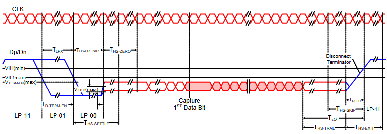|

## Bi-directional Data Lane Turnaround
Control 모드에서 진행

## Escape 
> LP 모드의 데이터 레인에 대한 특별 모드 (LPDT)
느리지만 전력을 거의 안 쓰고, 클록도 필요 없는 "비상용/저전력 통신 채널"
적은 데이터만 전송하고 싶은데 HS 모드에서는 오버헤드가 너무 큼.
Escape 모드는 클럭 레인 없이 비동기로도 동작가능하고 데이터 레인을 이용해 최소한의 명령을 주고 받을 수 있음.


### Remote Triggers
### Low-Power Data Transmission
### Ultra-Low Power State
### Escape Mode State Machine

## High-Speed Clock Transmission
```
HS 모드에서 클럭 레인은 데이터와 동상이 아니라 90도 위상차로 전송됨.
클럭 레인: 단방향, Escape 모드 x, ULPS o(특별 진입 시퀀스 존재)
데이터 레인에 active HS전송이 없을때 클럭 레인 PPI를 통해 나온 프로토콜은 클럭 레인을 멈춘다.
클럭 레인이 LP 모드라면 데이터 레인의 HS 데이터 전송 준비 시간은 길어진다.
```

| (Master) Procedure to Switch Clock Lane to Low-Power Mode |
|---|
|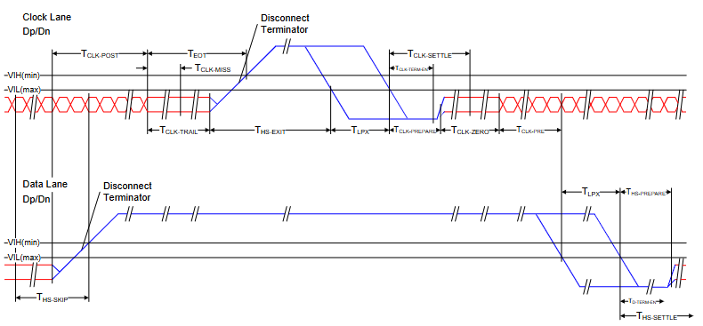|

```md
> Procedure to Switch Clock Lane to Low-Power Mode
### Master
1. Data Lane -> Low-Power mode
2. T_{CLK_POST}동안 클럭 레인 계속 토글, 그 후 T_{CLK-TRAIL}동안 HS-0 상태
3. HS-TX는 disable되고 LP-TX 활성화, 이후 T_{HS-EXIT}동안 STOP(LP-11) 상태 유지

### Slave
1. 토글되는 클럭 계속 받음.
2. T_{CLK-MISS} 이내에 클럭 멈춘거 감지 -> HS-RX disable -> STOP 상태 동안 기다림
3. TX의 클럭레인이 LP-11으로 변했다는걸 감지 -> HS disable -> STOP 상태 진입

```

```md
> Procedure to Initiate High-Speed Clock Transmission

| TX Side | RX Side |
|---|---|
| LP-11(Stop) drive | LP-11 관찰 |
| T_{LPX}동안 LP-01(HS-Req) drive | LP-11 -> LP-01 관찰 |
| T_{CLK_PREPARE}동안 LP-00(Bridge) drive | LP-01 -> LP-00 관찰, T_{CLK-TERM-EN}이후에 Line Termination 활성화 |
| HS driver 활성화 & LP driver 비활성화. T_{CLK-ZERO}동안 HS-0 drive | HS-RX 활성화. T_{CLK-SETTLE}동안 신호 변하는거 무시 |
|  | HS 신호 받기 |
| 데이터 레인 HS 시작 전에 T_{CLK-PRE}동안 HS 클럭 drive | HS클럭 받기 |
```

## Clock Lane Ultra-Low Power State
TX-STOP(LP-11) -> TX-ULPS-Rqst(LP-10) -> TX-ULPS(LP-00)
에러 발생하면 TX-ULPS-Rqst 이후 LP-01이나 LP-11이 감지되는데 이러면 초저전력 상태 진입은 폐지되고 Stop 상태로 돌아감.

## Global Operation Timing Parameters
| Global_Operation_Timing_Parameters |
|---|
|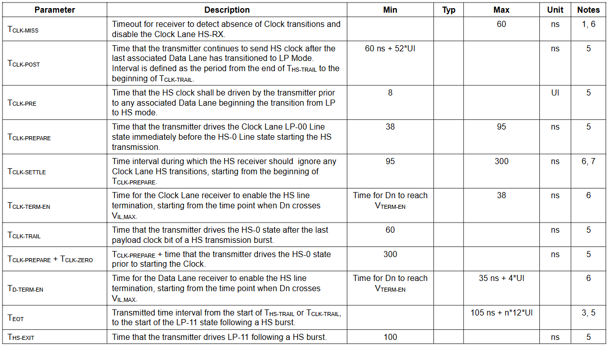|
|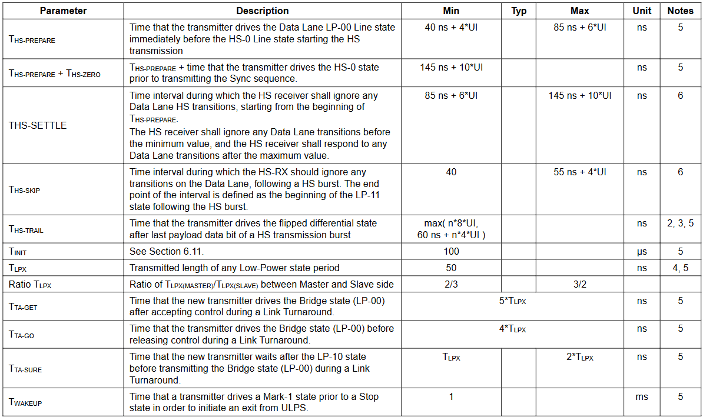|

```
Note: 
1. The minimum value depends on the bit rate. Implementations should ensure proper operation for all the supported bit rates.
2. If a > b then max( a, b ) = a otherwise max( a, b ) = b. 
3. T_{HS-TRAIL}에서 n = (정방향 HS 모드) ? 1 : 4
4. T_{LPX}는 내부 상태 머신 타이밍에 대한 거임. 외부에서 측정하면 약간 다름.
5. TX 파라미터
6. RX 파라미터
7. 표의 상태값은 요구사항이라기보다는 지침으로 생각해야함.
```

## Data Rate Dependent Parameters (informative)

| 종류 | 내용 | 파라미터 |
|---|---|---|
| Parameters Containing Only UI Values | 실제 시간 없이 UI로만 정의된 파라미터 | T_{CLK-PRE} |
| Parameters Containing Time and UI values | 표에서 UI와 실제 시간, 두개를 가지고 정의되는 파라미터들 | T_{HS-PREPARE}, T_{HS-PREPARE}+T_{HS-ZERO}, T_{HS-SETTLE}, T_{HS-SKIP}, T_{HS-TRAIL}, T_{CLK-POST}, T_{D-TERM-EN}, T_{EOT} |
| Parameters Containing Only Time Values (HS 관련) | 표에서 UI 없이 순수하게 실제 시간만으로 정의되는 파라미터들 | T_{HS-SKIP,MIN}, T_{CLK-MISS,MAX}, T_{CLK-TRAIL,MIN}, T_{CLK-TERM-EN}, T_{CLK-PREPARE}, T_{CLK-SETTLE}, T_{CLK-PREPARE}+T_{CLK-ZERO}, T_{HS-EXIT} |
| Parameters Containing Only Time Values That Are Not Data Rate Dependent (HS 무관) | 표에서 UI 없이 순수하게 실제 시간만으로 정의되는 파라미터들 | T_{INIT}, T_{LPX}, Ratio T_{LPX}, T_{TA-GET}, T_{TA-GO}, T_{TA-SURE}, T_{WAKEUP} |

> 실제 시간과 UI가 섞인 이유: 데이터레이트마다 UI가 바뀌기 때문에 시간값을 UI로만 카운트해서 구현한다면 데이트레이트가 바뀔때마다 카운트 값도 바꿔야해서 설계 복잡해짐.

## System Power States
HS 전송 모드, LP 모드, ULPS

## Initialization
```
1. 시스템/PPI 신호 → Master Init 시작 (Master Off → Master Init)
2. Master가 라인에 Stop 상태(LP-11)를 T_{INIT,MASTER} 이상 유지 (TX-Stop)
   ※ 이 구간 전까지 Slave는 라인 상태를 그냥 무시함
3. Slave가 Master의 Stop 상태를 감시하기 시작
4. T_{INIT,SLAVE} 만큼 감시가 지속되면 Slave도 초기화 완료 (Slave Init → RX-Stop)
```

## Deskew Calibration (TX)
> 데이터를 빠르게(>1.5Gbps) 보내기 전에, 클럭 레인과 데이터 레인에 같은 토글 패턴을 특수 sync 시퀀스와 함께 실어 보내서, 수신 측이 레인 간 도착 시간 차이를 스스로 측정하고 정렬할 수 있게 해주는 절차

## Global Operation Flow Diagram
| Data Lane Module State Diagram |
|---|
|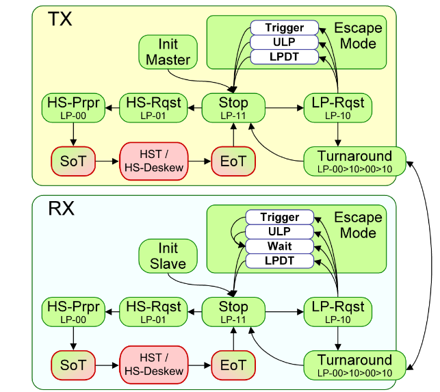|

| Clock Lane Module State Diagram |
|---|
|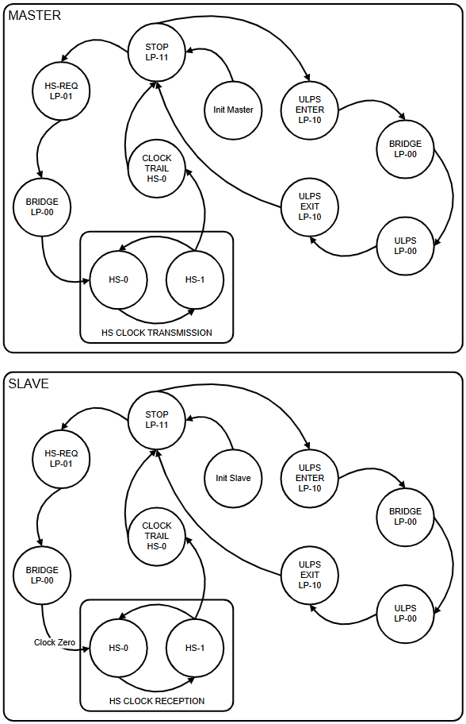|

# Fault Detection
```md
### Link 오작동 감지 세가지 mechanism
1. Contention Detection -> D-PHY 레벨, 전기적 충돌 감지
2. Sequence Error Detection -> D-PHY 레벨, 신호 시퀀스 오류 감지
3. Protocol Watchdog Timers -> protocol-level, 타임아웃 기반

> PHY 자체로 잡을 수 있는 결함은 1, 2번이며, PHY로 원천적으로 감지 불가능한 결함들은 상위 프로토콜 레벨에서 타임아웃으로 커버해야 한다
```

## Contention Detection
Contention이란? 정상 동작 시 한 레인은 항상 한쪽(Master or Slave)에서만 구동되어야 하는데, 오류나 시스템 오작동으로 양쪽에서 동시에 구동되거나, 양쪽 다 구동 안 되는 상태가 되는 것.

두 가지 충돌 상황:

양쪽 모두 LP 신호로 서로 반대 레벨을 구동 → 라인 전압이 V_OL,MIN과 V_OH,MAX 사이 애매한 값으로 안정됨 → V_IHCD 기준을 이용해 최소 한쪽은 반드시 감지 가능
한쪽은 LP-high, 다른 쪽은 HS-low를 구동 → 전압이 V_IL보다 낮게 안정됨 → LP-high를 보내던 쪽에서 감지됨

감지 방법: LP-CD(Contention Detection)와 LP-RX 기능의 조합. 단, 이전 상태가 TX-ULPS였던 경우는 예외(ULPS는 클럭/비트주기가 정의 안 되어 있어서 충돌 감지 자체가 불필요/불가능).

## Sequence Error Detection
라인 신호가 깨졌을 때 PHY 내부에서 잡아내는 오류들로, PPI를 통해 상위 프로토콜에 통보됩니다. 선택사항이지만 신뢰성 향상을 위해 강력 권장됩니다.

| 오류 종류 | 의미 |
|---|---|
| SoT Error | HS 시작 Leader 시퀀스에 1비트(또는 일부 멀티비트) 오류 발생 → 동기화는 됐지만 데이터 신뢰도는 낮음 |
| SoT Sync Error | Leader 시퀀스가 너무 깨져서 동기화 자체가 불가능한 수준 |
| EoT Sync Error | 전송 마지막 비트가 바이트 경계에 맞지 않음 (LP-11 감지 시 EoT 처리 중에만 발생 가능) |
| Escape Mode Entry Command Error | Escape 모드 진입 커맨드를 인식 못 함 |
| LP Transmission Sync Error | LP 데이터 전송 끝에 바이트 경계 동기화 실패 |
| False Control Error | LP-Rqst(LP-10) 뒤에 유효한 Escape/Turnaround 시퀀스가 안 이어지거나, HS-Rqst(LP-01) 뒤에 Bridge State(LP-00)가 제대로 안 이어질 때 |
> Leader 시퀀스(= SoT 시퀀스, HS Sync 시퀀스)란 HS 전송이 시작될 때 가장 먼저 보내는 특수 비트 패턴으로, 수신 측(RX)에게 "지금부터 진짜 HS 데이터가 시작된다"는 것을 알리고, 바이트 경계를 맞추기 위한 동기화 기준점

> 일부 Leader 시퀀스에 오류가 발생하더라도 충분히 유사함을 판별하는 로직을 통해 Leader 시퀀스인지 판단가능함.

## Protocol Watchdog Timers (informative)
존재 이유: PHY만으로는 모든 결함 케이스를 잡을 수 없기 때문에, 상위 프로토콜 레벨에서 타임아웃으로 최대 지속시간을 제한하는 보완 메커니즘입니다.

| 타이머 | 역할 |
|---|---|
| HS RX Timeout | HS 수신 중 일정 시간 안에 EoT가 안 오면 타임아웃 |
| HS TX Timeout | HS 송신 최대 길이 제한 (프로토콜별로 다름) |
| Escape Mode Timeout | Escape 모드 중 타임아웃. 상대측의 "Escape Silence Limit"보다 커야 함 |
| Escape Mode Silence Timeout | LP TX-00 상태의 최대 길이 제한 (예: 디스플레이 모듈이 이 한계를 갖고, 초과 시 호스트가 타임아웃 처리) |

### Turnaround Errors

- Turnaround 절차는 항상 Stop State에서 시작
- 드라이브 측이 교대되는 일련의 Low-Power State들로 진행되며 Bridge State(LP-00)로 마무리
- 최종적으로 상대측에서 구동하는 Stop State가 뒤따르는 Turn State 응답으로 절차가 완결됨 (Turn State = 정상 완료를 알리는 ACK 역할)
- 이 순서를 벗어나면 "False Control Error"가 표시될 수 있음
- Turn State 응답(ACK)이 일정 시간 내 오지 않으면 프로토콜이 타임아웃 처리해야 함
  - 이 타임아웃 값은 시스템별 최대 가능 Turnaround 시간보다 커야 함
  - PHY 자체에는 이 조건에 대한 타임아웃이 없음

# Interconnect and Lane Configuration
> Interconnect의 물리적 특성
* HS(고속, 저전압) 신호와 LP(저속, 저전력) 신호를 동시에 실어 날라야 함
* 그래서 물리적 연결은 balanced, differential(차동), point-to-point 방식으로 구현되어야 하고, 그라운드 기준(referenced to ground)이어야 함
* 전체 Interconnect는 여러 구간(PCB, flex-foil, 케이블 등)이 cascade(직렬로 연결) 되어 구성될 수 있음

## Lane Configuration
> Lane의 성능 = TX + TLIS(배선구조) + RX

| 3요소 | 정의 |
|---|---|
| TX | 송신기 |
| RX | 수신기 |
| TLIS | Transmission-Line-Interconnect-Structure |

```md
이 세 요소의 경계(split)는 IC 핀 위치로 정의됩니다. 즉 "칩 안쪽은 TX/RX 스펙, 칩 밖으로 나간 배선은 TLIS 스펙"이라는 명확한 구분선을 둔 것입니다.
물리적 크기 면에서 보통 TLIS가 가장 큰 비중을 차지하며, PCB/flex-foil 트레이스뿐 아니라 via와 커넥터도 포함됩니다.

> D-PHY 스펙이 "칩만 잘 만들면 끝"이 아니라, PCB 설계자가 지켜야 할 배선 규칙까지 스펙 범위 안에 포함시킨다.
```

## Boundary Conditions
> 임피던스/전기적 경계조건

| 항목 | reference value |
|---|---|
| 차동 임피던스 (Differential) | 100 Ω |
| 단일 종단 임피던스 (Single-ended, per Line) | 50 Ω |
| 공통모드 임피던스 (Common-mode, 두 라인 합산) | 25 Ω |

* Tolerence는 주파수 대역 전체에 걸친 S-parameter(반사계수 등) 템플릿으로 정밀하게 규정.
    * 고속 신호에서는 임피던스가 주파수에 따라 달라지기 때문(스킨 효과, 유전손실 등)

* 느슨하게 결합된(loosely coupled) 차동선을 권장
    * 두 라인 사이의 결합을 느슨하게 유지해서, 차동/단일종단 양쪽 모드 모두에서 임피던스가 비교적 일관되게 유지되도록 설계
    * 만약 두 라인을 너무 강하게 결합(tightly coupled)시켜 설계하면, 차동 모드에서는 임피던스가 최적이지만 단일종단(LP) 모드에서는 임피던스가 크게 달라져 버리는 문제 발생

* Flight Time 제한
    * 신호가 Interconnect 전체를 통과하는 데 걸리는 시간(전파 지연)은 최대 2ns 이내여야함.
    * 배선의 물리적 길이 상한선을 사실상 규정하는 값입니다 (전파 속도를 고려하면 대략 PCB 기준 수십 cm 수준의 길이 제한으로 환산됨)

## Definitions
> 주파수 관련: S-parameter 템플릿이 몇 GHz까지의 대역을 커버해야 하는지를 정하는 기준

| 용어 | 정의 | 내용 |
|---|---|---|
| f_h | 데이터 전송의 최고 기본 주파수 | f_h = 1/(2 × UI_INST,MIN), 구현자는 자신의 디바이스가 지원 가능한 최소 순간 UI (UI_INST,MIN)를 스펙으로 명시해야 함 |
| f_hMAX | 특정 디바이스가 지원하는 f_h의 최댓값 — 디바이스 스펙 항목 | |
| f_LP,MAX | LP 모드에서의 최대 토글 주파수 | |
| f_INT, f_INT,MIN | RF 간섭 주파수. f_INT,MIN은 관련 RF 간섭원(interferer)들의 주파수 대역 하한선 | |
| f_MAX | 1.5Gbps 이하, 초과에 따라 구분 | 이하 -> max(1/5·t_F,MIN, 1/5·t_R,MIN) — 즉 상승/하강 시간(rise/fall time)의 최소값 기준으로 결정, 초과 -> f_MAX = ¾ × data rate |

```
저속: 엣지 속도(slew rate)가 주파수 상한 결정
고속: 데이터 레이트 자체(UI)가 주파수 상한을 결정하는 방식으로 전환
```

## S-parameter Specifications
> TX, TLIS(배선), RX 각각의 물리적 성능을 S-parameter(산란 파라미터)라는 고주파 회로 특성 지표로 규정

| 대상 | 규정 방식 |
|---|---|
| TLIS | Mixed-mode, 4-port parameter |
| Tx,Rx | Mixed-mode, reflection(return loss) parameter |

> TLIS는 신호가 통과하는 경로이므로 4포트(입력2 + 출력2) 특성이 필요하고, TX/RX는 신호가 반사되는 정도(자기 자신의 임피던스 매칭)만 문제가 되므로 반사(reflection) 파라미터만으로 충분합니다.

```txt
"Mixed-mode" 파라미터란?
차동 신호(HS)와 단일종단 신호(LP)를 함께 다룰 수 있는 파라미터 체계
```

### 주파수 축의 두가지 방식
| 기준 축 | 대상 | 이유 |
|---|---|---|
| 정규화된 주파수, bit rate 대비 | 대부분의 S-parameter 요구사항 | 성능 요구사항이 비트 레이트에 비례하기 때문 (속도가 바뀌면 요구조건도 같이 스케일됨) |
| 절대 주파수, f_MAX까지 | 외부 RF 간섭 억제용 파라미터만 | RF 간섭은 실제 물리적 주파수(예: 특정 통신 대역)에서 발생하므로 비트레이트와 무관하게 고정된 절대 주파수 기준이 필요 |

> f_MAX 이상의 고주파 영역은 이 스펙이 직접 규정하지 않고, 회로 자체의 자연스러운 감쇠 특성에 맡긴다

* 스펙은 TLIS 전체의 성능과 RX/TX 각각의 최대 반사만 규정
* TLIS 내부(PCB, 커넥터, 케이블 등 여러 구간)에 걸쳐 손실/반사/모드변환 예산을 어떻게 배분할지는 시스템 설계자의 재량
* 시스템 설계 및 신호 라우팅 가이드라인(Annex B: rule of thumb)

## Characterization Conditions
| Set-up for S-parameter Characterization of RX TX and TLIS |
|---|
|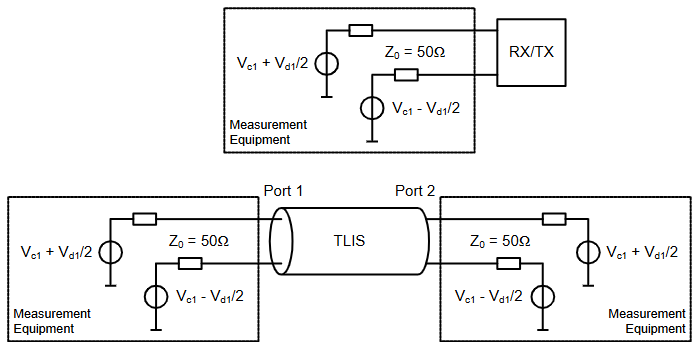|

* "S-parameter를 측정할 때 기준 임피던스(50Ω)와 측정 구성(RX/TX 단독 vs TLIS 양단)을 어떻게 세팅해야 하는지"
* "S-parameter 이름 표기법([측정한 모드][구동한 모드][측정 포트][구동 포트])을 어떻게 해석해야 하는지"를 규정.
* 특히 mixed-mode 표기법(Sdd, Sdc, Scd, Scc 등)은 차동 신호와 공통 신호 간의 모드 변환 특성까지 정량적으로 표현하기 위해 사용.

```md
### TLIS 예시1
Sdd21: V_{d1} 인가, V_{c1} 인가x | 전원인가 포트:1, 측정포트: 2 => **신호 관찰**
Sdd21 = Port 1에 넣은 차동 신호 크기 대비, Port 2에서 나온 차동 신호 크기의 비율

### TLIS 예시2
Sdc21: Port 1에서 V_{c1} 인가, V_{d1} 인가x | 전원인가 포트:1, 측정포트: 2 => **신호 관찰**
Sdc21 = "공통모드 → 차동모드 모드 변환" 정도를 나타냄 => **배선의 비대칭성**
```

## Interconnect Specifications
> TLIS(배선) "속도가 빠를수록(>1.5Gbps) 요구 마진이 더 엄격해진다"

### Differential Characteristics
> 배선을 지나면서 신호가 너무 약해지거나(삽입손실) 되튕기지(반사손실) 않게

### Common-mode Characteristics
> 차동 신호와 별개로, 공통모드 신호도 똑같이 반사 없이 깨끗해야 함

### Intra-Lane Cross-Coupling
> 같은 Lane 안 두 라인(Dp/Dn)이 LP 신호로 쓰일 때 서로 간섭하지 않게

### Mode-Conversion Limits
> 차동 신호가 배선 비대칭 때문에 공통모드로 새어나가지(또는 반대로) 않게

### Inter-Lane Cross-Coupling
> 클럭 레인과 데이터 레인이 서로 혼선 안 일으키게

### Inter-Lane Static Skew
> 배선 설계 단계에서부터 클럭-데이터 간 도착시간 차이(skew)를 최소화

## Driver and Receiver Characteristics
> TLIS(배선) 양 끝에 붙는 칩(TX/RX 모듈)의 반사(reflection) 특성도 스펙 안에 들어와야 링크가 정상 동작한다.

### Differential Characteristics
> RX/TX 각각의 차동 반사(Sdd) 템플릿. 저주파에서 엄격, 고주파로 갈수록 완화

### Common-Mode Characteristics
> TX는 고정값(-6dB/-2.5dB), RX는 별도 템플릿 — RX가 DC 그라운드 종단이 안 되기 때문

### Mode-Conversion Limits
> TX/RX 모두 -26dB 이하 (fMAX까지) — 배선과 동일 기준

### Inter-Lane Matching
> 여러 레인 간 반사 특성 편차 -26dB 이하 — Lane 간 skew/품질 편차 방지

# Electrical Characteristics
> PHY 내의 모든 블록에 대한 전기적 스펙

| Electrical Functions of a Fully Featured D-PHY Transceiver |
|---|
|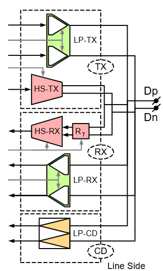|

| 기능 블록 | 역할 | 특징 |
|---|---|---|
| HS-Tx | 고속 차동 신호 송신 |  |
| HS-Rx | 고속 차동 신호 수신 | **스위치** 가능한 병렬 종단(R_T) 포함 |
| LP-Tx | 저전력 단일종단 신호 송신 | Push-pull 드라이버 구조 |
| LP-Rx | 저전력 단일종단 신호 수신 | 종단 없는(un-terminated) 수신기 |
| LP-CD | Contention(충돌) 감지 담당 |  |

| D-PHY Signaling Levels  |
|---|
|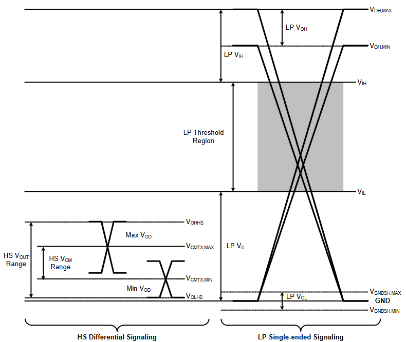|
| Push-pull 드라이버: HIGH일 땐 전원 쪽으로, LOW일 땐 그라운드 쪽으로 강하게 밀어붙이는 구조 |
| 만약 HS 신호가 LP Rx 입장에서 "알 수 없는 애매한 값"으로 보이면 LP-RX가 오작동할 수 있습니다. 그래서 아예 HS 신호 전체를 LP Rx 관점에서는 "그냥 로우(0) 상태"로 보이도록 전압대를 낮게 설계해서, HS 전송 중에는 LP-RX가 안전하게 "LP-11(Stop state와 유사한 로우 상태)"로 오인한 채로 조용히 있게 만드는 것 |

## Driver Characteristics
### High-Speed Transmitter
### Low-Power Transmitter
## Receiver Characteristics
### High-Speed Receiver
### Low-Power Receiver
## Line Contention Detection
## Input Characteristics

# High-Speed Data-Clock Timing
## High-Speed Clock Timing
## Forward High-Speed Data Transmission Timing
### Data-Clock Timing Specifications
## Reverse High-Speed Data Transmission Timing

# Regulatory Requirements

# Annex A Logical PHY-Protocol Interface Description (informative)
## Signal Description
## High-Speed Transmit from the Master Side
## High-Speed Receive at the Slave Side
## High-Speed Transmit from the Slave Side
## High-Speed Receive at the Master Side
## Low-Power Data Transmission
## Low-Power Data Reception
## Turn-around
## Calibration

# Annex B Interconnect Design Guidelines (informative)
## Practical Distances
## RF Frequency Bands: Interference
## Transmission Line Design
## Reference Layer
## Printed-Circuit Board
## Flex-foils
## Series Resistance
## Connectors

# Annex C 8b9b Line Coding for D-PHY (normative)
## Line Coding Features
### Enabled Features for the Protocol
### Enabled Features for the PHY
## Coding Scheme
### 8b9b Coding Properties
### Data Codes: Basic Code Set
### Comma Codes: Unique Exception Codes
### Control Codes: Regular Exception Codes
### Complete Coding Scheme
## Operation with the D-PHY
### Payload: Data and Control
### Details for HS Transmission
### Details for LP Transmission
## Error Signaling
## Extended PPI
```md
# Functional PPI 확장 개요

## 배경: 왜 PPI를 확장하는가

- 프로토콜과의 인터페이스는 **Comma 심볼 사용을 관리**하기 위해 기능 핸들(TX 방향)과 플래그(RX 방향)로 확장됨
- 필요 시, 송신측 PHY는 **TxReadyHS / TxReadyEsc** 신호로 프로토콜의 데이터 전달을 잠시 보류시킬 수 있음 (기존 PPI에 이미 존재하는 기능)

---

## TxValidHS 신호 (HS 데이터용 Valid 신호)

- HS 데이터 전송을 위해 **TxValidHS** 신호가 PPI에 추가됨
- **인코딩 동작 덕분에 Link의 Idle 상태 표현이 가능**해짐: 새로운 유효 데이터가 없을 때, 송신기가 준비되어 있어도 제공된 데이터가 유효하지 않으면 → **Idle 심볼을 스트림에 삽입**
- 기존 기본 PHY PPI와 달리, **코딩된(coded) PHY의 Valid 신호는 TX/RX 양쪽 모두에서 능동적으로 데이터 관리에 활용 가능** → PHY/Protocol 계층에 더 큰 유연성 제공
- LPDT(Low Power Data Transmission)에서는 이 Valid 시그널링이 이미 존재함
- **TxValidHS 추가의 효과**: 기존 PPI 설명에 있던 "TxRequestHS 관련 제약(프로토콜이 항상 유효한 데이터를 제공해야 한다는 조건)"을 제거함

---

## RX 측 에러 플래그

- 예상치 못한 시퀀스가 관찰될 경우, 에러를 프로토콜에 플래그로 알릴 수 있음
- 많은 종류의 에러가 감지 가능하지만, **모든 에러 플래그를 구현할 필요는 없음**
- 어떤 에러 플래그를 구현할지는 **구현자의 비용/효과(cost/benefit) 판단**에 달림
- 이 에러 기능들은 **D-PHY 준수 여부에 영향을 주지 않음** (참고용 정보로만 제공됨)

---

## 공통 제약사항

- 모든 제어 신호는 **TxByteClk 또는 RxByteClk에 동기화**되어야 함
- 제어 신호 클럭 주파수는 **직렬 비트 레이트의 1/9 이상**이어야 함

---

## 표

> 표는 **코딩 서브레이어(coding sub-layer, EPPI)** 위에 추가되는 PPI 신호들을 나열한 것

즉, 기본 PPI 위에 **Comma 심볼 기반 코딩 계층을 다루기 위한 확장 신호 세트**가 표이며, TxValidHS/TxProMarker 계열은 필수적 기능 관리용, Rx 쪽 대부분(RxAlignError, RxBadSymbol, RxEoTError, RxIdle 등)은 **선택적(optional) 에러/상태 진단용 플래그**로 구성됩니다.
```

### Input
| Symbol | Categories | Description |
|---|---|---|
| **TxProMarkerEsc** | MXAX (SXXA) | Functional handle to insert a Protocol-marker symbol in the serial stream for LPDT.<br>Active HIGH signal |
| **TxProMarkerHS** | MXXX (SRXX) | Functional handle to insert a Protocol-marker symbol in the serial stream for HS transmission.<br>Active HIGH signal |
| **TxValidHS** | MXXX (SRXX) | Functional handle for the protocol to hold on providing data to the PHY without ending the HS transmission. In the case of a continued transmission request without Valid data, the PHY coding layer inserts Idle symbols.<br>Active HIGH signal |

### Output
| Symbol | Categories | Description |
|---|---|---|
| **RxAlignErrorEsc** | SXAX (MXXA) | Flag to indicate that a Comma code has been observed in the LPDT stream that was not aligned with the assumed word boundary.<br>Active HIGH signal (optional) |
| **RxAlignErrorHS** | SXXX (MRXX) | Flag to indicate that a Comma code has been observed during HS reception that was not aligned with the assumed word boundary.<br>Active HIGH signal (optional) |
| **RxBadSymbolEsc** | SXAX (MXXA) | Flag to indicate that a non-existing symbol was received using LPDT.<br>Active HIGH signal (optional) |
| **RxBadSymbolHS** | SXXX (MRXX) | Flag to indicate that a non-existing symbol was received in HS mode.<br>Active HIGH signal (optional) |
| **RxEoTErrorEsc** | SXAX (MXXA) | Flag to indicate that at EoT, after LP transmission, a transition to LP-11 has been detected without being preceded by an EoT-marker symbol.<br>Active HIGH signal (optional) |
| **RxEoTErrorHS** | SXXX (MRXX) | Flag to indicate that at EoT, after HS transmission, a transition to LP-11 has been detected without being preceded by an EoT-marker symbol.<br>Active HIGH signal (optional) |
| **RxIdleEsc** | SXAX (MXXA) | Indication flag that Idle patterns are observed at the Lines during LPDT.<br>Active HIGH signal (optional) |
| **RxIdleHS** | SXXX (MRXX) | Indication flag that Idle patterns are observed at the Lines in HS mode.<br>Active HIGH signal (optional) |
| **RxProMarkerEsc** | SXAX (MXXA) | Functional flag to know that a Protocol-marker symbol occurred in the serial stream using LPDT. This is communicated to the protocol synchronous with the data, exactly at the position where it occurred. Therefore, the interface either shows a flag plus non-valid data or no-flag with valid data.<br>Active HIGH signal |
| **RxProMarkerHS** | SXXX (MRXX) | Functional flag to know that a Protocol-marker symbol occurred in the serial stream for HS mode. This is communicated to the protocol synchronous with the ByteClk, exactly at the position where it occurred. Therefore, the interface either shows a flag plus non-valid data or no-flag with valid data.<br>Active HIGH signal |

## Complete Code Set
